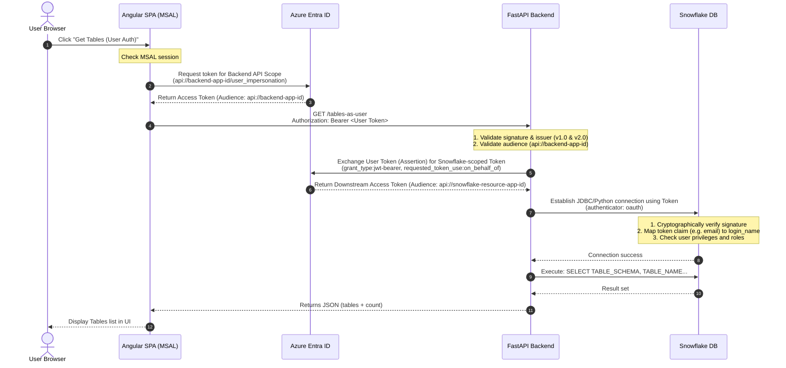

# Snowflake Tables Viewer — Multi-Flow Integration Application

This repository contains a full-stack application demonstrating two secure authentication flows with **Azure AD (Microsoft Entra ID)** and **Snowflake External OAuth**:

1. **Service Principal Flow** (`GET /tables`): Client Credentials grant where the backend application connects to Snowflake as its own Service account (`API_SERVICE_USER`).
2. **User Authentication Flow** (`GET /tables-as-user`): On-Behalf-Of (OBO) JWT Bearer grant where the backend logs in as the actual human user, assuming their specific Snowflake role and user privileges.

## Project Structure

```
snowflake-app/
├── backend/                  # FastAPI REST API
│   ├── app/                  # Application source code
│   └── tests/                # Pytest suite
└── frontend/
    └── buyback-webapp/     # Angular 21+ Single Page App (SPA)
```

---

## 1. Authentication Architecture & Flow

### UI → FastAPI → Snowflake (On-Behalf-Of User Flow)



---

## 2. Azure AD App Registrations Setup

You will need **three** separate Application Registrations in your Azure Entra ID Tenant:

### App 1: Angular UI Login (SPA Client)
* **Redirect URIs**: Single Page Application (SPA) → `http://localhost:4200`
* **Expose an API**: None.
* **API Permissions**:
  * Add a permission → **My APIs** → Select **App 3: FastAPI Backend Client**
  * Choose **Delegated permissions** → Check `user_impersonation`.
  * **Important**: Click **Grant admin consent** for your tenant.

### App 2: Snowflake Resource Application
* **Expose an API**:
  * Application ID URI: `api://<snowflake-resource-client-id>` (e.g., `api://28c90a4e-4a96-4f78-ab0e-171bd1a984ba`)
  * Add a scope:
    * Name: `session:scope:SNOWFLAKE_API_ROLE`
    * Who can consent: Admins and users
    * State: Enabled

### App 3: FastAPI Backend Client
* **Authentication**: Web Platform / Client Secret. Create a client secret and save the value.
* **Expose an API**:
  * Application ID URI: `api://<backend-client-id>` (e.g., `api://89a80661-cf8b-4e10-b3f4-b2b06be53a81`)
  * Add a scope:
    * Name: `user_impersonation`
    * Who can consent: Admins and users
    * State: Enabled
  * Add **Authorized client applications**:
    * Client ID: App 1 (UI Client ID)
    * Scope: select `api://<backend-client-id>/user_impersonation`
* **API Permissions**:
  * Add a permission → **My APIs** → Select **App 2: Snowflake Resource App**
  * Choose **Delegated permissions** → Check `session:scope:SNOWFLAKE_API_ROLE`.
  * **Important**: Click **Grant admin consent** for your tenant.

---

## 3. Snowflake Security Integration Setup

Log in to Snowflake as `ACCOUNTADMIN` and run the following SQL commands to configure the security integrations and mapped users.

### Configuration A: Service Principal (Non-User) Flow
Uses `EXTERNAL_OAUTH_TOKEN_USER_MAPPING_CLAIM = 'appid'` to map the incoming application ID to a Snowflake service account user.

```sql
USE ROLE ACCOUNTADMIN;

CREATE OR REPLACE SECURITY INTEGRATION AZURE_ENTRA_OAUTH
  TYPE = EXTERNAL_OAUTH
  ENABLED = TRUE
  EXTERNAL_OAUTH_TYPE = AZURE
  EXTERNAL_OAUTH_ISSUER = 'https://sts.windows.net/<YOUR_TENANT_ID>/'
  EXTERNAL_OAUTH_JWS_KEYS_URL = 'https://login.microsoftonline.com/<YOUR_TENANT_ID>/discovery/v2.0/keys'
  EXTERNAL_OAUTH_AUDIENCE_LIST = ('api://<YOUR_SNOWFLAKE_RESOURCE_CLIENT_ID>')
  EXTERNAL_OAUTH_TOKEN_USER_MAPPING_CLAIM = 'appid'
  EXTERNAL_OAUTH_SNOWFLAKE_USER_MAPPING_ATTRIBUTE = 'login_name'
  EXTERNAL_OAUTH_ANY_ROLE_MODE = 'ENABLE';

-- Create the Service User mapped to the FastAPI Client Application ID
CREATE USER IF NOT EXISTS API_SERVICE_USER
  LOGIN_NAME = '<YOUR_FAST_API_CLIENT_ID>' -- must match App 3 Client ID exactly
  DISPLAY_NAME = 'API Service User'
  MUST_CHANGE_PASSWORD = FALSE;

-- Setup Roles and Permissions
CREATE ROLE IF NOT EXISTS SNOWFLAKE_API_ROLE;
GRANT ROLE SNOWFLAKE_API_ROLE TO USER API_SERVICE_USER;
ALTER USER API_SERVICE_USER SET DEFAULT_ROLE = SNOWFLAKE_API_ROLE;
ALTER USER API_SERVICE_USER SET DEFAULT_WAREHOUSE = COMPUTE_WH;

-- Grant standard data access privileges to the role
GRANT USAGE ON WAREHOUSE COMPUTE_WH TO ROLE SNOWFLAKE_API_ROLE;
GRANT USAGE ON DATABASE "SNOWFLAKE_SAMPLE_Apps" TO ROLE SNOWFLAKE_API_ROLE;
GRANT USAGE ON SCHEMA "SNOWFLAKE_SAMPLE_Apps".PUBLIC TO ROLE SNOWFLAKE_API_ROLE;
GRANT SELECT ON ALL TABLES IN SCHEMA "SNOWFLAKE_SAMPLE_Apps".PUBLIC TO ROLE SNOWFLAKE_API_ROLE;
GRANT SELECT ON FUTURE TABLES IN SCHEMA "SNOWFLAKE_SAMPLE_Apps".PUBLIC TO ROLE SNOWFLAKE_API_ROLE;
```

### Configuration B: On-Behalf-Of (User) Flow
Uses `EXTERNAL_OAUTH_TOKEN_USER_MAPPING_CLAIM = 'email'` to map the user's Microsoft identity to their Snowflake credentials.

> [!TIP]
> Using `'email'` instead of `'upn'` is highly recommended because personal Microsoft accounts (MSA) and external guest users do not emit a `upn` claim in Azure AD access tokens, leading to validation errors.

```sql
USE ROLE ACCOUNTADMIN;

CREATE OR REPLACE SECURITY INTEGRATION AZURE_ENTRA_OAUTH_OBO
  TYPE = EXTERNAL_OAUTH
  ENABLED = TRUE
  EXTERNAL_OAUTH_TYPE = AZURE
  EXTERNAL_OAUTH_ISSUER = 'https://sts.windows.net/<YOUR_TENANT_ID>/'
  EXTERNAL_OAUTH_JWS_KEYS_URL = 'https://login.microsoftonline.com/<YOUR_TENANT_ID>/discovery/v2.0/keys'
  EXTERNAL_OAUTH_AUDIENCE_LIST = ('api://<YOUR_SNOWFLAKE_RESOURCE_CLIENT_ID>')
  EXTERNAL_OAUTH_TOKEN_USER_MAPPING_CLAIM = 'email'
  EXTERNAL_OAUTH_SNOWFLAKE_USER_MAPPING_ATTRIBUTE = 'login_name'
  EXTERNAL_OAUTH_ANY_ROLE_MODE = 'DISABLE'; -- Forces users to assume roles they are explicitly granted

-- Create Snowflake Roles
CREATE ROLE IF NOT EXISTS SNOWFLAKE_READER_ROLE;
CREATE ROLE IF NOT EXISTS SNOWFLAKE_ADMIN_ROLE;

-- Create Snowflake Users mapped to their respective Azure AD Emails
-- Note: Mapped login names are case-sensitive matching the exact lowercase output from Entra
CREATE USER IF NOT EXISTS AZURE_USER_OBO
  LOGIN_NAME = 'manish.mishra026@outlook.com' -- must be lowercase to match token claim
  DISPLAY_NAME = 'Azure AD OBO User'
  DEFAULT_ROLE = SNOWFLAKE_READER_ROLE
  DEFAULT_WAREHOUSE = COMPUTE_WH
  MUST_CHANGE_PASSWORD = FALSE;

-- Grant Roles to the OBO User
GRANT ROLE SNOWFLAKE_READER_ROLE TO USER AZURE_USER_OBO;
GRANT ROLE SNOWFLAKE_ADMIN_ROLE TO USER AZURE_USER_OBO;

-- Grant usage privileges on warehouse and database
GRANT USAGE ON WAREHOUSE COMPUTE_WH TO ROLE SNOWFLAKE_READER_ROLE;
GRANT USAGE ON WAREHOUSE COMPUTE_WH TO ROLE SNOWFLAKE_ADMIN_ROLE;
GRANT USAGE ON DATABASE "SNOWFLAKE_SAMPLE_Apps" TO ROLE SNOWFLAKE_READER_ROLE;
GRANT USAGE ON DATABASE "SNOWFLAKE_SAMPLE_Apps" TO ROLE SNOWFLAKE_ADMIN_ROLE;
GRANT USAGE ON SCHEMA "SNOWFLAKE_SAMPLE_Apps".PUBLIC TO ROLE SNOWFLAKE_READER_ROLE;
GRANT USAGE ON SCHEMA "SNOWFLAKE_SAMPLE_Apps".PUBLIC TO ROLE SNOWFLAKE_ADMIN_ROLE;

-- Grant specific table privileges (Reader vs Admin)
-- 1. Mapped Reader role only has access to the EMPLOYEES table
GRANT SELECT ON TABLE "SNOWFLAKE_SAMPLE_Apps".PUBLIC.EMPLOYEES TO ROLE SNOWFLAKE_READER_ROLE;

-- 2. Mapped Admin role has access to both EMPLOYEES and ADMIN_EMPLOYEES tables
GRANT SELECT ON TABLE "SNOWFLAKE_SAMPLE_Apps".PUBLIC.EMPLOYEES TO ROLE SNOWFLAKE_ADMIN_ROLE;
GRANT SELECT ON TABLE "SNOWFLAKE_SAMPLE_Apps".PUBLIC.ADMIN_EMPLOYEES TO ROLE SNOWFLAKE_ADMIN_ROLE;

```

---

## 4. Setup and Configuration

### Backend Setup (`backend/`)
1. Create and activate a Python virtual environment:
   ```bash
   cd backend
   python -m venv .venv
   .venv\Scripts\activate
   ```
2. Install requirements:
   ```bash
   pip install -r requirements.txt
   ```
3. Copy `.env.example` to `.env` and fill in the Azure and Snowflake values (refer to Section 5 below).
4. Run the API:
   ```bash
   uvicorn app.main:app --host 0.0.0.0 --port 8000 --reload
   ```

### Frontend Setup (`frontend/buyback-webapp/`)
1. Install node dependencies:
   ```bash
   cd frontend/buyback-webapp
   npm install
   ```
2. Update the MSAL settings in `src/app/config/auth.config.ts` to reference your App Registrations:
   ```typescript
   export const msalConfig: Configuration = {
     auth: {
       clientId: '183b3bcc-4183-4566-a467-7d2f945c5880', // App 1: UI Client ID
       authority: 'https://login.microsoftonline.com/a66a44bf-bf04-4606-839d-3f956853233b',
       redirectUri: 'http://localhost:4200',
       postLogoutRedirectUri: 'http://localhost:4200',
     }
   };
   ```
3. Run the development server:
   ```bash
   npm start
   ```
   Open `http://localhost:4200` in your browser.

---

## 5. Environment Variables Configuration (`backend/.env`)

### Configuration for Service Principal Flow (Non-User)
| Variable | Value / Format | Description |
| :--- | :--- | :--- |
| `AZURE_TENANT_ID` | GUID | Azure AD Tenant ID |
| `AZURE_CLIENT_ID` | GUID | App 3: FastAPI Backend Client ID |
| `AZURE_CLIENT_SECRET` | Secret String | App 3: Client Secret |
| `AZURE_AUDIENCE` | `api://<App_2_Resource_ID>` | App ID URI of App 2 (Snowflake Resource) |
| `AZURE_SCOPE` | `api://<App_2_Resource_ID>/.default` | Scope for client credentials exchange |
| `SNOWFLAKE_ACCOUNT` | e.g. `dhhvjpy-sv13832` | Snowflake account locator |
| `SNOWFLAKE_DATABASE` | Database Name | e.g., `SNOWFLAKE_SAMPLE_Apps` |
| `SNOWFLAKE_SCHEMA` | Schema Name | e.g., `PUBLIC` |
| `SNOWFLAKE_WAREHOUSE` | Warehouse Name | e.g., `COMPUTE_WH` |
| `SNOWFLAKE_ROLE` | Role Name | e.g., `SNOWFLAKE_API_ROLE` |
| `SNOWFLAKE_APPLICATION_ID_URI`| `api://<App_2_Resource_ID>` | App ID URI of App 2 (Snowflake Resource) |

### Configuration for User Auth / OBO Flow (Prefix: `USER_AUTH_`)
| Variable | Value / Format | Description |
| :--- | :--- | :--- |
| `USER_AUTH_AZURE_TENANT_ID` | GUID | Azure AD Tenant ID |
| `USER_AUTH_AZURE_CLIENT_ID` | GUID | App 3: FastAPI Backend Client ID |
| `USER_AUTH_AZURE_CLIENT_SECRET` | Secret String | App 3: Client Secret |
| `USER_AUTH_AZURE_AUDIENCE` | `api://<App_3_Backend_ID>` | App ID URI of App 3 (FastAPI Backend) |
| `USER_AUTH_SNOWFLAKE_ACCOUNT` | e.g. `dhhvjpy-sv13832` | Snowflake account locator |
| `USER_AUTH_SNOWFLAKE_DATABASE` | Database Name | e.g., `SNOWFLAKE_SAMPLE_Apps` |
| `USER_AUTH_SNOWFLAKE_SCHEMA` | Schema Name | e.g., `PUBLIC` |
| `USER_AUTH_SNOWFLAKE_WAREHOUSE` | Warehouse Name | e.g., `COMPUTE_WH` |
| `USER_AUTH_SNOWFLAKE_ROLE` | Role Name | e.g., `SNOWFLAKE_API_ROLE` |
| `USER_AUTH_SNOWFLAKE_APPLICATION_ID_URI`| `api://<App_2_Resource_ID>`| App ID URI of App 2 (Snowflake Resource) |

---

## 6. Troubleshooting Checklist

* **Error**: `AADSTS500131: Assertion audience does not match the Client app presenting the assertion`
  * **Cause**: The incoming token's audience (`aud`) does not match the backend API's client ID.
  * **Fix**: Ensure that the Angular frontend requests a scope belonging to the **Backend Client App** (App 3, e.g. `api://89a80661-cf8b-4e10-b3f4-b2b06be53a81/user_impersonation`) in both the login request and the `protectedResourceMap` configurations.
* **Error**: `Failed to connect to DB... Invalid OAuth access token`
  * **Cause A**: Snowflake username/login mapping claim mismatch. Check if the token's mapping claim (e.g., `email`) is lowercase and matches the Snowflake `login_name` attribute case-sensitively. 
  * **Cause B**: Missing UPN. Personal Microsoft accounts (Outlook/Hotmail) have `upn: null`. Use `email` as the user mapping claim instead.
  * **Cause C**: Unauthorized role. Ensure the role requested (`USER_AUTH_SNOWFLAKE_ROLE`) is explicitly granted in Snowflake to the OBO user.
* **Error**: `Invalid token provided: Invalid issuer`
  * **Cause**: Issuer version mismatch. Our backend supports both Azure AD v1.0 (`https://sts.windows.net/{tenant_id}/`) and v2.0 (`https://login.microsoftonline.com/{tenant_id}/v2.0`) issuers.
* **Error**: `AADSTS500011: The resource principal was not found in the tenant`
  * **Cause**: Incorrect Snowflake resource App ID URI.
  * **Fix**: Set `USER_AUTH_SNOWFLAKE_APPLICATION_ID_URI` to the actual App ID URI registered in your tenant (e.g. `api://28c90a4e-4a96-4f78-ab0e-171bd1a984ba`), not the host URL `https://*.snowflakecomputing.com`.
